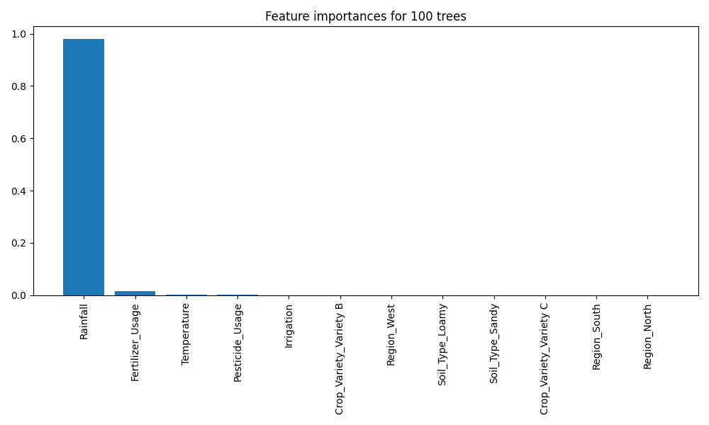

# Examples: An introduction to random forests 
� ExploreAI Academy

In this notebook, we look at a specific ensemble learning technique, the random forest. This algorithm is the combination of multiple decision trees. We'll examine how we can implement these models in Python using the `sklearn` library and also how random forests contribute to understanding the importance of predictive variables within a dataset.

## Learning objectives

* Understand how random forests differ from decision trees.
* Understand the training process of random forests and how we can use them to make predictions.
* Know how to build a random forest regression model.
* Understand how to use random forests to assess predictive variable importance.

## 1. Introduction to random forests

### Overfitting in decision trees

Overfitting is a risk when working with decision trees � it is easy for the tree to become too complex, and thus fit details of the individual data points rather than the overall properties of the distributions they are drawn from. 

This issue can be addressed by using **random forests**.

### What is ensemble learning?

Ensemble learning in machine learning is the practice of **combining multiple models** to try and achieve higher overall model performance. 

In general, ensembles consist of multiple **heterogeneous or homogeneous** models trained on the same dataset. 

Each of these models is used to make predictions using input (either exactly the same or samples out of the same data), then  **aggregated** across all models in some way (e.g. by taking the mean or having a weighted mean) to produce the final output. 

The  **`random forest`** is an example of a commonly used ensemble model.

### What is a random forest?

A random forest is a powerful non-parametric algorithm and an **ensemble** method **built on decision trees**, meaning that it relies on aggregating the results of an ensemble of decision trees. 

The ensembled trees are **randomised** and the output is the **aggregated prediction** of the individual trees.

*The mean prediction is used for a regression problem while classification problems use the mode of the ensembled trees as opposed to the mean.*

## 2. How do random forests work?

### Fitting the data:

Keep in mind that `N` refers to the **number of observations** (rows) in the training dataset, and `p` is the **number of predictor variables** (columns). The following is the typical algorithm for a random forest:

1. **Bootstrapping**: Drawing *with replacement* from the training dataset, randomly sampled `N` observations.
 

2. Use the `N` observations to **grow a random forest tree** as follows: 
_ 
At each node: 
i. Select a random subset, `m`, of predictor variables, where $m<\sqrt{p}$. 
ii. Pick the best variable/split-point among the selected predictor variables. 
iii. Divide the data into two subsets based on the selected split. 
iv. Repeat until the stopping criteria are satisfied (e.g. minimum node sample size reached)._
 

3. Repeat until the **desired number of random forest trees** is reached.

Since we draw randomly with replacement from the training data during the bootstrapping step, it is possible that:
- Some data **samples get resampled** and thus reused when fitting different trees in the random forest.
- Some data **samples don't get sampled at all** and thus do not get used in fitting the random forest.

This means that the **dataset each tree is grown on** is **slightly different**, so random forests are **less likely to overfit** than decision trees.

### Making predictions:

Random forests **combine multiple trees to make a prediction** as follows:

The somewhat surprising result with such ensemble methods is that the sum can be greater than the parts: that is, a majority vote among a number of estimators can end up being better than any of the individual estimators doing the voting! (An estimator is a tree.)

## 3. Building a random forest regression model

Now that we have an understanding of how random forests work, let's **implement** one **using `scikit-learn`**.   

### Import libraries and data

### Preprocessing

### Training

This process of fitting a decision tree to our data can be done in `scikit-learn` with the ``RandomForestRegressor`` estimator:

As with decision trees, random forests also have hyperparameters. Some of the more important ones include:

- **n_estimators**: The number of trees to include in the forest.
- **min_samples_leaf**: The minimum number of samples required to be at a leaf node.
- **max_depth**: The maximum depth of each forest tree (i.e. the number of nodes between root and leaf node).
- **random_state**: A number used to seed the random number generator. Ensures that we get the same tree each time we call model.fit() � _this particular hyperparameter is important in random forests since their training procedure is inherently random._
- **criterion**: The function to measure the quality of a split. The model uses the mean squared error (MSE) by default.

> To learn more about other RandomForestRegressor hyperparameters, run `help(RandomForestRegressor)` in a new cell.

### Testing

To evaluate the performance of our model, we can report the **mean squared error** or **plot** predicted output vs. expected output.

### Tuning model hyperparameters 

In most cases, the default hyperparameter values do not offer the best model performance. In such cases, we have to **tune model hyperparameters** to **yield the best-performing model**.

Let's make some changes to the `n_estimators` parameter and compare the results:

#### Training the various models:

#### Let's evaluate the models:

We calculate the RMSE for each model and plot the actual vs. predicted values:

Looking at the RMSEs, the forest with 20 trees performed the best. 

> Can you find the optimal parameters (including `max_depth` and `min_samples_leaf`)?

## 4. Assessing variable importance

Knowing the **predictive power** � how different predictive variables affect the model's performance � can prove useful in cases where the dataset is large and high-dimensional. 

It allows us to establish **which predictive variables we can discard** without significantly affecting the model's performance. Additionally, models that are presented with fewer predictor variables tend to train faster.  

Unlike decision trees, random forests can be used to calculate a **measure of predictor variable importance**. 

One way to compute this measure in the regression setting is to use the training data that was left out when constructing the random forest. Then the variable importance for a given variable can be calculated by:

1. Keeping other variables the same.
2. Shuffling the value of the variable in question.
3. Calculating the percentage increase in MSE.  

This way, **more important variables** will have **higher percentage increases** in the MSE.

In sklearn's `RandomForestRegressor` we can easily obtain variable importances using:
    `model.feature_importances_`

## 5. Advantages and disadvantages of random forests

**Advantages:**

* Less overfitting compared to a single decision tree (i.e. generalises much better).
* Requires little data preparation � e.g. no real need to standardise features.
* Extremely flexible and usually have high prediction accuracy.

**Disadvantages**

* Complex and not very intuitive.
* Computation costs can be high if many trees are used.

#  

# Examples: Solving a regression problem
 
� ExploreAI Academy

In this train, we look at how to experiment with various modeling methods to solve a regression problem.

## Learning objectives

By the end of this train, you should be able to:
* Load and prepare a dataset.
* Train and evaluate linear, non-linear and ensemble regression models.

## 1. Introduction

We wish to examine and understand how socio-economic and environmental factors contribute to the rate of deforestation. We have been given a dataset that captures this information. Our goal to to model this relationship through regression analysis. 

In the sections that follow, we explore the process of training and evaluating various regression models on a similar dataset. Through the model experimentation process, we are able to compare the performance of various models, guiding the selection of the best model for predicting our target variable. 

## 2. Dataset and libraries

We begin by setting up our working environment by importing the necessary `Python` libraries that we will use throughout the notebook

Then, we load and inspect the dataset to get familiar with its structure and contents.

## 3. Data exploration

Here, we will perform a preliminary exploration of our dataset to get a better understanding of the data we are working with.

This initial exploration of our data, will help uncover underlying patterns and relationships that can inform our choice of models.

`data.info()` gives us more information about our columns including their data types and the count of non-null values.

It seems we do not have any null values in our dataset. Also, all the features in the dataset are numeric.

Let's now create a pairwise plot to visualise and understand the relationships among the variables. Using `sns.pairplot()`, we can generate scatter plots for each pair of variables in our dataset, providing a comprehensive overview of how each variable interacts with the others. This can help us identify patterns that may influence our modeling decisions.

Only `forest coverage` and `biodiversity_index` show a linear-like relationship with the target variable `deforestation_rate`. This observation suggests the potential of these variables to be strong predictors in a linear regression model. The rest of the variables, however, do not demonstrate a clear linear trend. This indicates more complex relationships that might not be adequately captured by a linear model alone.

Next, we perform **correlation analysis** to understand the correlation between the different features present in our dataset and our target variable,`deforestation_rate`.

We use the `.corr()` to calculate the correlation matrix for our dataset, then filtered the result to only contain the correlation coefficients related to the `deforestation_rate` column and sort them from the highest to the lowest. The results show that biodiversity_index, forest_coverage, population_density and protected_areas have some relationship with deforestation_rate. 

This way, we we can identify strong predictors for `deforestation_rate`.

**Note:** We need to consider both the positive and negative correlations, that is, the **highest positive** and the **highest negative values**. Alternatively, we can use `.abs` method to obtain the absolute values of the correlations, allowing us to sort them regardless of their direction.

Let's also plot a heatmap visualisation to further aid in understanding these relationships, highlighting the most significant correlations. This image makes it easy to also see relationship between the predictive variables, something that is good to keep in mind when doing regression analyses.

## 4. Data preprocessing

We prepare the data for modeling by splitting it into training and testing sets and scaling the features to help our models perform optimally.

In the above code block, we prepare our features `X` and target variable `y` for modeling. The dataset is also split into training and testing sets, and feature scaling is applied using `MinMaxScaler`. This process ensures that our regression models do not bias towards variables with larger magnitudes.

## 5. Model training and evaluation

### 5.1 Simple linear regression model

Our journey into model training begins with a simple linear regression model. This model, while simple, serves as a great baseline to compare more complex models against. 

A simple linear regression model uses only one independent variable to predict the dependent variable.

From the correlation analysis we performed above, we observed that `biodiversity_index` had the strongest correlation with our target variable and also demonstrated a linear relationship. This makes it a good candidate as the predictor variable for our SLRM.

Note that, we convert the scaled arrays back into DataFrames to maintain the ability to reference columns by name.

Our simple linear regression model performed relatively well with an R-squared value above 0.7, but it could probably be improved on by adding a few more variables to the model. Let's see how this compares to the performance of other more complex models.

### 5.2 Other regression models

Let's expand our analysis by applying more complex models. Exploring these models will help us capture more complex patterns that a simple linear model might miss. This can, in turn, improve our model.

#### A generic function for model training and evaluation:

Let's develop a general function that we can use to train and test various regression models. This will enhance re-usability and reduce redundancy.

The `train_and_evaluate_model` function trains the provided model on the preprocessed and scaled training data, evaluates it against the test set, and returns the trained model along with its R� and Mean Squared Error (MSE) scores.

**Note:** While using a generic function for model training and evaluation is a good idea for simplicity and efficiency, it may be limiting in some cases such as where the data or the importance of features varies across models. In such cases, we can train and evaluate each model separately to tailor the selection of features and fine-tune the model's performance to the specific characteristics of the data.

### 5.2.1 Multiple linear regression model

We apply the previously defined function to train and evaluate a multiple linear regression model, where we use all available features (after scaling) to predict the rate of deforestation. This way, we get to leverage the predictive value of the rest of the features.

We get to observe how a more complex linear approach compares to the simpler, single-variable linear regression.

We can see that the model has performed better, given the increase in R2 score and a decrease in the MSE. It would be interesting to test this model with only the strongest predictors as well - it could be informative to assess whether there is a big drop in predictive power if we drop some of the weaker predictors. 

### 5.2.2 Decision tree regression model

We apply the previously defined function to train and evaluate a decision tree regression model. This allows us to explore the capabilities of a non-linear model in capturing the non-linear patterns we earlier observed in the data.

The decision tree does not perform as well as expected. It could be because there are several variables included that don't hold that much predictive power, or the fact that our tree has a max_depth parameter that was set to 4, which is quite shallow. Ideally, we should run multiple iterations of decision trees, with different parameters to determine the optimal fit.

### 5.3 Ensemble models

We have so far only trained stand alone models. Here, we want to apply ensembling techniques where we combine multiple machine learning models in an attempt to improve predictive performance. Let's try out both a homogeneous and a heterogeneous ensemble model.

### 5.3.1 Random forest regression model

We apply the previously defined function to train and evaluate a random forest regression model. It leverages the the power of homogenous ensemble learning by combining multiple decision trees.

We can see an improvement in the performance of our model. This is because random forests, by aggregating the predictions of numerous decision trees, reduce the risk of overfitting and offer a more generalisable model. Again, try testing it with different levels of max_depth to see what the outcomes are. 

### 5.3.2 Stacking ensemble model

Let's also try and capitalise on the unique strengths of other different model types than just the decision trees. To be precise, we will apply stacking where we will train a meta-learner based on the outputs of some base models.

We will use some of the models we have already trained as our base learners and a new model as the meta-learner.

Let's start by defining our base models and the meta-learner:

We then apply our generic function to train and evaluate a stacking regression model.

We have used the `StackingRegressor` from `scikit-learn`, specifying our previously trained multiple linear regression, and random forest models as the base models and a linear regression model as the final estimator. 

We note a marginal improvement in performance in comparison to the stand alone models, but should also consider whether the cost (in terms of time and memory), is worth the improvement in predictive powers.

In our journey to solve a regression problem, we have explored different modeling options, each offering different strengths that could be used to solve the problem at hand. In the end, our goal is to achieve a good balance between performance and simplicity, and remember, more advanced models may not always be the best, despite convincing metrics!

#  

# Exercise: The random forest
� ExploreAI Academy

In this exercise, we build, evaluate and compare random forest regression models.

## Learning objectives

By the end of this train, you should be able to:
* Build a random forest regression model in Python.
* Experiment with different number of trees.
* Evaluate feature importance using a random forest. 

## Exercises

In this exercise, we will be using the `Crop_yield` dataset that contains various factors that could influence the yield of a particular crop across different regions.

### Import libraries and dataset

### Preparing the dataset

In the code below, we prepare our dataset for modeling by encoding categorical variables to convert them to a numeric format.

### Exercise 1

Create a function named `train_rf_model` to train and evaluate a random forest regression model on the encoded dataset. 

The function should take in 3 parameters:
- DataFrame containing the encoded features
- A string containing the name of the target variable
- The number of estimators for the random forest 

It then returns: 
- The trained model object 
- The RMSE and R2 scores of the model's performance on the test set. 

### Exercise 2

Use the function you have defined in **Exercise 1** to train and evaluate three different random forest regression models with each having the following number of estimators respectively: `50`, `100`, and `200`. Store the results in a dictionary.

### Exercise 3

Say we wish to understand which features have the most impact on crop yield predictions.

Use the `feature_importances_` attribute from our lastly trained random forest model in **Exercise 2** to return a series containing the feature importance score for each of the features in our dataset, sorted in descending order. 

## Solutions

### Exercise 1

The function `train_rf_model` is designed to train and evaluate a random forest regression model. 

It takes 3 parameters, `data`, `target_variable`, `n_estimators`.

The function returns two items: the trained random forest model `rf_model` and a dictionary containing the evaluation metrics, `mse` and `r2`.

### Exercise 2

In the code above, we use the previously created function to train and evaluate multiple random forest models, each with a different number of trees (estimators). 

The for loop iterates over each value in `estimators_list`, where it calls the `train_rf_model()` function, passing the required parameters including the current number of estimators `n` as arguments.

The two items returned by the function are stored in separate variables, `model` and `metric`.

The `results` dictionary is then used to store the evaluation metrics for each model trained with a different number of trees. The keys are strings indicating the number of trees, and the values are the dictionary of metrics returned by the function.

### Exercise 3

In the code above, we use the `feature_importances_` attribute of the trained random forest model to extract the importance scores for each feature. 

The variable `feature_names` stores the list of feature names that were used to train the model. This will be used for mapping each importance score to its corresponding feature name.

`importances` is a pandas series object where each feature's importance score is associated with its name. 

In `sorted_importances`, we get the importances sorted in descending order to get a quick view of the features considered most important by the model.

> Which top 2 features contribute the most to the model's predictive ability?

Understanding feature importance and the contribution of each variable to the model's predictions offers us an opportunity to streamline our models. This understanding enables us to focus on the most influential features, thereby reducing model complexity without significantly sacrificing performance.

In refining your model, you should consider an experiment: retrain the model using only the subset of features that have demonstrated the highest importance scores. This encourages an exploration into how much we can reduce complexity while maintaining, or even potentially improving, model accuracy.

# Project Analysis Report - Random_Forest_50_Trees

## Model Performance
- RMSE: 0.8555332568271099
- R2 Score: 0.9920970977810426

## Feature Importances

---

# Project Analysis Report - Random_Forest_100_Trees

## Model Performance
- RMSE: 0.8552713754444304
- R2 Score: 0.9921019352462954

## Feature Importances

---

# Project Analysis Report - Random_Forest_200_Trees

## Model Performance
- RMSE: 0.8547160178085811
- R2 Score: 0.9921121888958909

## Feature Importances

---